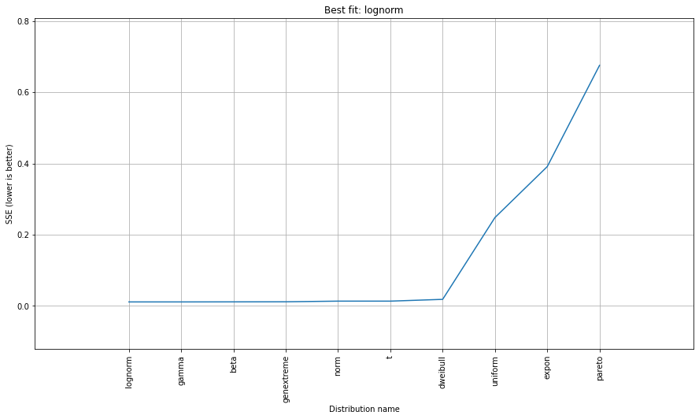

.. _code_directive:

-------------------------------------

Examples
''''''''''

Fit distribution
--------------------------------------------------

Specify distfit parameters. In this example nothing is specied and that means that all parameters are set to default.

.. code:: python

    from distfit import distfit
    import numpy as np

    # Example data
    X = np.random.normal(10, 3, 2000)
    y = [3,4,5,6,10,11,12,18,20]

    # From the distfit library import the class distfit
    from distfit import distfit

    # Initialize
    dist = distfit()

    # Search for best theoretical fit on your emperical data
    dist.fit_transform(X)

    # Plot
    dist.plot()

.. |fig1a| image:: ../figs/example_fig1a.png
    :scale: 70%

.. table:: Distribution fit
   :align: center

   +---------+
   | |fig1a| |
   +---------+

Note that the best fit should be [normal], as this was also the input data. However, many other distributions can be very similar with specific loc/scale parameters. It is however not unusual to see gamma and beta distribution as these are the "barba-pappas" among the distributions. Lets print the summary of detected distributions with the Residual Sum of Squares.

.. code:: python

    # Make plot
    dist.plot_summary()

.. table:: Summary of fitted theoretical Distributions
   :align: center

   +---------------+
   | |fig1summary| |
   +---------------+

Specify distribution
--------------------------------------------------

Suppose you want to test for one specific distribution, such as the normal distribution. This can be done as following:

.. code:: python

    dist = distfit(distr='norm')
    dist.fit_transform(X)

    # [distfit] >fit..
    # [distfit] >transform..
    # [distfit] >[norm] [RSS: 0.0151267] [loc=0.103 scale=2.028]

    dist.plot()

Make predictions
--------------------------------------------------

The ``predict`` function will compute the probability of samples in the fitted *PDF*. 
Note that, due to multiple testing approaches, it can occur that samples can be located 
outside the confidence interval but not marked as significant. See section Algorithm -> Multiple testing for more information.

.. code:: python

    # Example data
    X = np.random.normal(10, 3, 2000)
    y = [3,4,5,6,10,11,12,18,20]

    # From the distfit library import the class distfit
    from distfit import distfit

    # Initialize
    dist = distfit()

    # Search for best theoretical fit on your emperical data
    dist.fit_transform(X)

    # Make prediction on new datapoints based on the fit
    dist.predict(y)

    # The plot function will now also include the predictions of y
    dist.plot()

.. |fig1b| image:: ../figs/example_fig1b.png
    :scale: 70%

.. table:: Plot distribution with predictions
   :align: center

   +---------+
   | |fig1b| |
   +---------+

Extract results
--------------------------------------------------

All the results are stored in the object. In our examples it is the ``dist`` object.
The results of the prediction are stored in y_proba and y_pred.

.. code:: python

    # All scores of the tested distributions
    print(dist.summary)

    # Distribution parameters for best fit
    dist.model

    # Show the predictions for y
    print(dist.y_pred)
    # ['down' 'down' 'none' 'none' 'none' 'none' 'up' 'up' 'up']

    # Show the probabilities for y that belong with the predictions
    print(dist.y_proba)
    # [2.75338375e-05 2.74664877e-03 4.74739680e-01 3.28636879e-01 1.99195071e-01 1.06316132e-01 5.05914722e-02 2.18922761e-02 8.89349927e-03]
 
    # All predicted information is also stored in a structured dataframe
    print(dist.df)
    #    y   y_proba y_pred         P
    # 0 -8  0.000028   down  0.000003
    # 1 -6  0.002747   down  0.000610
    # 2  0  0.474740   none  0.474740
    # 3  1  0.328637   none  0.292122
    # 4  2  0.199195   none  0.154929
    # 5  3  0.106316   none  0.070877
    # 6  4  0.050591     up  0.028106
    # 7  5  0.021892     up  0.009730
    # 8  6  0.008893     up  0.002964
