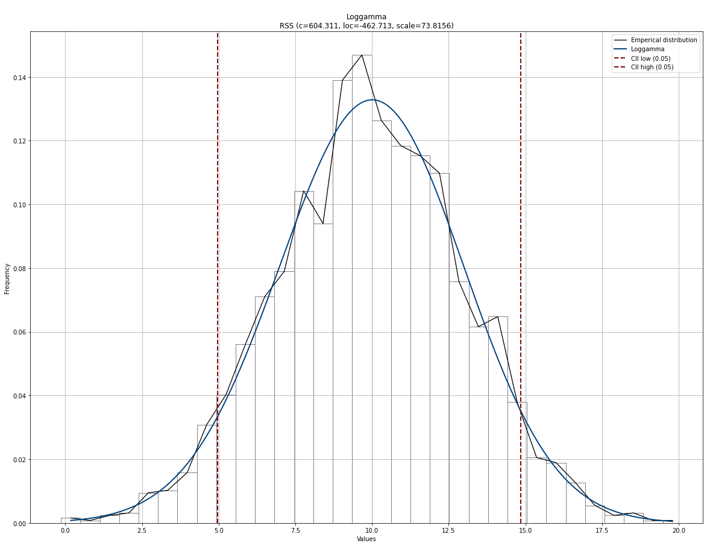

.. _code_directive:

-------------------------------------

Examples
''''''''''

Fit distribution
--------------------------------------------------

.. code:: python
    from distfit import distfit
    import numpy as np

    # Example data
    X = np.random.normal(10, 3, 2000)
    y = [3,4,5,6,10,11,12,18,20]

    # From the distfit library import the class distfit
    from distfit import distfit

    # Initialize
    dist = distfit()

    # Search for best theoretical fit on your emperical data
    dist.fit_transform(X)

    # Plot
    dist.plot()

.. table:: Distribution fit
   :align: center

   +---------+
   | |fig1a| |
   +---------+

Make predictions
--------------------------------------------------

The ``predict`` function will compute the probability of samples in the fitted *PDF*. 
Note that, due to multiple testing approaches, it can occur that samples can be located 
outside the confidence interval but not marked as significant. See section Algorithm -> Multiple testing for more information.

.. code:: python

    # Example data
    X = np.random.normal(10, 3, 2000)
    y = [3,4,5,6,10,11,12,18,20]

    # From the distfit library import the class distfit
    from distfit import distfit

    # Initialize
    dist = distfit()

    # Search for best theoretical fit on your emperical data
    dist.fit_transform(X)

    # Make prediction on new datapoints based on the fit
    dist.predict(y)

    # The plot function will now also include the predictions of y
    dist.plot()

.. |fig1b| image:: ../figs/example_fig1b.png
    :scale: 80%

.. table:: Plot distribution with predictions
   :align: center

   +---------+
   | |fig1b| |
   +---------+
