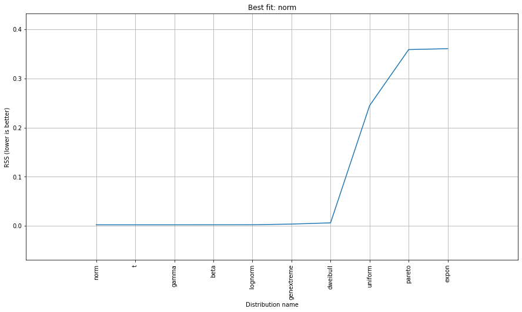
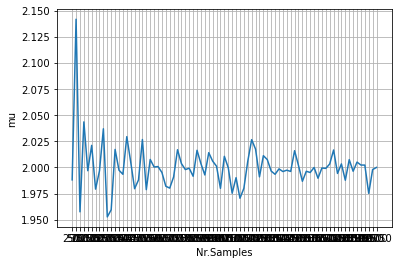
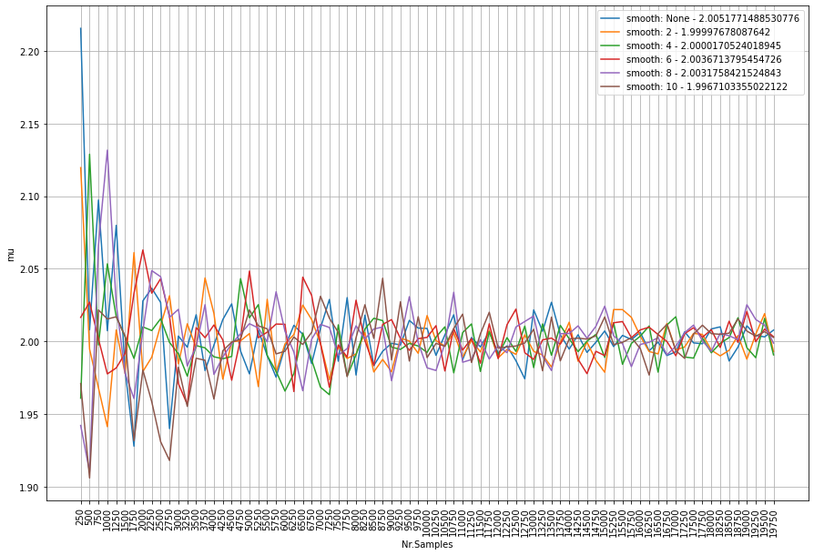
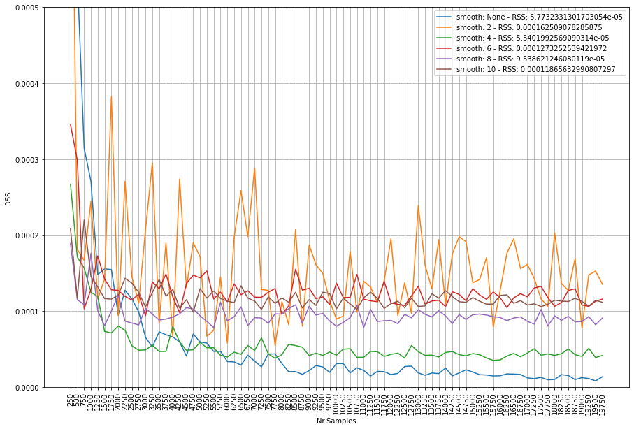

Parameter fitting
''''''''''''''''''''''

The **performance** of ``distfit`` can be examined by various aspects. In this section we will evaluate the detected parameters, and the goodness of fit of the detected probability density function (pdf). 

Lets evalute the performance of ``distfit`` of the detected parameters when we draw random samples from a normal (Gaussian) distribution with *mu*=0 and *std*=2. We would expect to find *mu* and *std* very close to the input values.

.. code:: python

    from distfit import distfit
    import numpy as np
    # Initialize model and specify distribution to be normal
    X = np.random.normal(0, 2, 5000)

For demonstration puprposes we pre-specify the ``normal`` distribution to find the best parameters. When we do that, as shown below, a *mean* or *loc* of **0.004** is detected and a standard deviation (scale) with **2.02** which is very close to our input parameters. 

.. code:: python

    dist = distfit(distr='norm')
    dist.fit_transform(X)
    print(dist.model)

    # {'distr': <scipy.stats._continuous_distns.norm_gen at 0x15d8406b208>,
    #  'params': (0.00444619012906402, 2.0209991080448138),
    #  'name': 'norm',
    #  'RSS': 0.0021541850376229827,
    #  'loc': 0.00444619012906402,
    #  'scale': 2.0209991080448138,
    #  'arg': (),
    #  'CII_min_alpha': -3.319801522804139,
    #  'CII_max_alpha': 3.328693903062266}

.. code:: python

    dist.plot()

.. _gaus_mu_0:

.. figure:: ../figs/gaus_mu_0.png
    :scale: 80%

Probability Density Function fitting
''''''''''''''''''''''''''''''''''''''''''''

To measure the goodness of fit of *pdfs*, we will evaluate multiple *pdfs* using the **RSS** metrics. The goodness of fit scores are stored in ``dist.summary``. In this example, we will **not** specify any distribution but only provide the empirical data to the model.

.. code:: python

    dist = distfit()
    dist.fit_transform(X)
    print(dist.summary)

    # 	distr         RSS  ...        scale                                     arg
    # 0        norm  0.00215419  ...        2.021                                      ()
    # 1           t  0.00215429  ...      2.02105                    (2734197.302263666,)
    # 2       gamma  0.00216592  ...   0.00599666                   (113584.76147029496,)
    # 3        beta  0.00220002  ...      39.4803  (46.39522231565038, 47.98055489856441)
    # 4     lognorm  0.00226011  ...      139.173                 (0.014515926633415211,)
    # 5  genextreme  0.00370334  ...      2.01326                   (0.2516817342848604,)
    # 6    dweibull  0.00617939  ...        1.732                   (1.2681369071313497,)
    # 7     uniform    0.244839  ...      14.3579                                      ()
    # 8      pareto    0.358765  ...  2.40844e+08                   (31772216.567824945,)
    # 9       expon    0.360553  ...      7.51848                                      ()

The model detected ``normal`` as the **best** pdf but a good RSS score is also detected for the *t* and *gamma* distribution. But this is not unexpected to see. A summary plot of the evaluated pdfs looks a following:

.. code:: python

    dist.plot_summary()

.. _gaus_mu_0_summary:

Varying sample sizes
'''''''''''''''''''''''''''''''''''''

The goodness of fit will change according the number of samples that is provided. In the example above we specified 5000 samples which gave good results. However, with a relative low number of samples, a poor fit can occur. For demonstration purposes we will vary the number of samples and store the *mu*, *std*. In this experiment we are generating random continuous values from a normal distribution. We will fixate fitting normal distribution and examine the loc, and scale parameters.

.. code:: python

    # Initialize without verbose.
    dist = distfit(verbose=0)

    # Create random data with varying number of samples
    samples = np.arange(250, 10000, 250)

    # Initialize model
    distr='norm'
    
    # Estimate parameters for the number of samples
    for s in samples:
        print(s)
        X = np.random.normal(0, 2, s)
        dist.fit_transform(X)
        out.append([dist.model['loc'], dist.model['scale'], dist.model['name'], s])

When we plot the results, ``distfit`` nicely shows that by increasing the number of samples results in a better fit of the parameters. A convergence towards mu=2 and std=0 is clearly seen.

.. |fig2| image:: ../figs/perf_sampling_std.png
    :scale: 90%

.. table:: Sampling example
   :align: center

   +---------+---------+
   | |fig1|  | |fig2|  |
   +---------+---------+

Smoothing
''''''''''''''''''''''''''''''''

If the number of samples is very low, it can be difficult to get a good fit on your data.
A solution is to play with the ``bin`` size, eg. increase bin size. 
Another manner is by smoothing the histogram with the ``smooth`` parameter. The default is set to ``None``.
Lets evaluate the effect of this parameter.

.. code:: python

    # Generate data
    X = np.random.normal(0, 2, 100)

.. code:: python

    # Fit model without smoothing
    model = distfit()
    model.fit_transform(X)
    model.plot()

    # Fit model with heavy smoothing
    model = distfit(smooth=10)
    model.fit_transform(X)
    model.plot()

.. |logo1| image:: ../figs/gaus_mu_0_100samples.png
    :scale: 60%

.. |logo2| image:: ../figs/gaus_mu_0_100samples_smooth10.png
    :scale: 60%

.. table:: Comparison smoothing parameter
   :align: center

   +---------+---------+
   | |logo1| | |logo2| |
   +---------+---------+

Here we are going to combine the number of samples with the smoothing parameter.
It is interesting to see that there is no clear contribution of the smoothing. The legends depicts the smoothing window with the average *mu*. We see that all smooting windows jump up-and-down the mu=2. However, the more samples, the smaller the variation becomes. The smooting parameter seems to be only effective in very low sample sizes.

.. _perf_sampling_mu_smoothing_1:

Lets analyze the RSS score acorss the varying sample sizes and smooting windows. The figure below depicts number of samples on the x-axis, and the RSS score on the y-axis. The lower the RSS score (towards zero) the better the fit. What we clearly see is that **not** smooting shows the best fit by an increasing number of samples (blue line). As an example, from *7000* samples, the smooting window does **not** improve the fitting at all anymore. The conlusion is that smooting seems only be effective for samples sizes lower then approximately 5000 samples. Note that this number may be different across data sets.

.. _perf_sampling_mu_smoothing_2:

.. figure:: ../figs/normal_smooth_sample_sizes.png
    :scale: 80%

Integer fitting
''''''''''''''''''''''''''''''''

It is recommend to fit integers using the ``method=discrete``.

Here, I will demonstrate the effect of fitting a uniform distribution on integer values.
lets generate random integer values from a uniform distribution, and examine the RSS scores.
We will iterate over sample sizes and smoothing windows to analyze the performance.

.. code:: python

    import matplotlib.pyplot as plt
    from tqdm import tqdm
    import pandas as pd
    import numpy as np
    from distfit import distfit

    # Sample sizes
    samples = np.arange(250, 20000, 250)
    # Smooting windows
    smooth_window=[None, 2, 4, 6, 8, 10]

    # Figure
    plt.figure(figsize=(15,10))

    # Iterate over smooting window
    for smooth in tqdm(smooth_window):
    # Fit only for the uniform distribution
        dist = distfit(distr='uniform', smooth=smooth, stats='RSS', verbose=0)
        # Estimate paramters for the number of samples
        out = []

        # Iterate over sample sizes
        for s in samples:
            X = np.random.randint(0, 100, s)
            dist.fit_transform(X)
            out.append([dist.model['score'], dist.model['name'], s])

        df = pd.DataFrame(out, columns=[dist.stats,'name','samples'])
        ax=df[dist.stats].plot(grid=True, label='smooth: '+str(smooth) + ' - RSS: ' + str(df[dist.stats].mean()))

    ax.set_xlabel('Nr.Samples')
    ax.set_ylabel('RSS')
    ax.set_xticks(np.arange(0,len(samples)))
    ax.set_xticklabels(samples.astype(str))
    ax.set_ylim([0, 0.001])
    ax.legend()

The code above results in the underneath figure, where we have varying sample sizes on the x-axis, and the RSS score on the y-axis. The lower the RSS score (towards zero) the better the fit. What we clearly see is that orange is jumping up-and-down. This is smooting window=2. Tip: do not use this. Interesting to see is that **not** smooting shows the best fit by an increasing number of samples. Smooting does **not** improve the fitting anymore in case of more then *7000* samples. Note that this number may be different across data sets. 

From these results we can conclude that smooting seems only usefull for small(er) samples sizes.

.. _int_smooth_samples_sizes:

.. raw:: html

	

	

		
	

	

