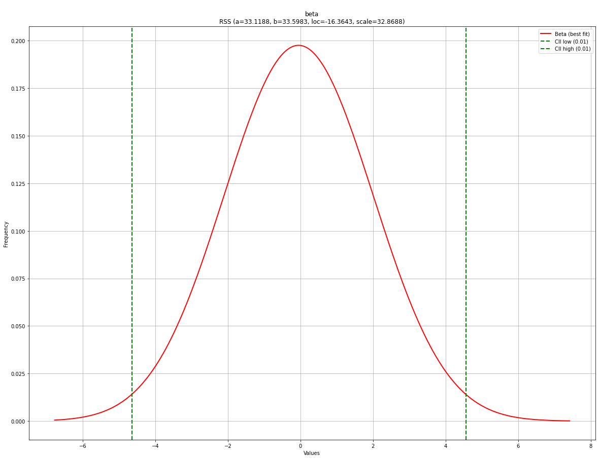
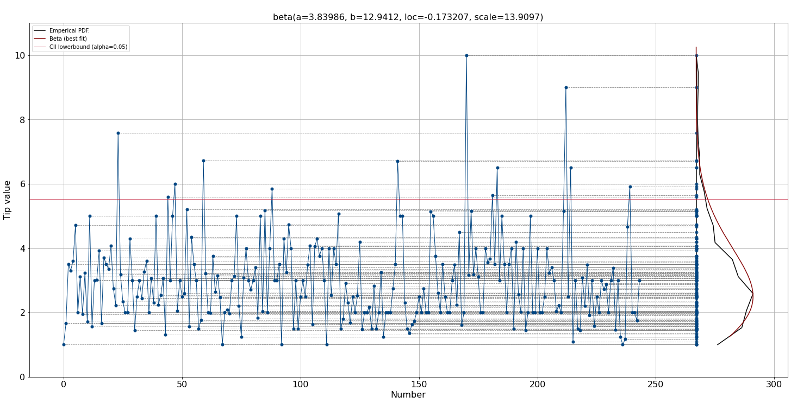

Basic plot
##################################################

Let's start plotting the empirical data using a histogram and the PDF. These plots will help to visually guide whether a distribution is a good model for a dataset. The confidence intervals are automatically set to 95% CII but can be changed using the alpha parameter during initialization. When using the plot functionality, it automatically shows the histogram in bars and with a line, PDF/CDF, and confidence intervals. All these properties can be manually specified or removed.

We will start generating random data from the normal distribution and create a basic PDF and CDF plot.

.. code:: python
	
	# Import
	from distfit import distfit
	import numpy as np

	# Create dataset
	X = np.random.normal(0, 2, 10000)
	y = [-8,-6,0,1,2,3,4,5,6]

	# Initialize
	dfit = distfit(alpha=0.01)

	# Fit
	dfit.fit_transform(X)

	# Plot seperately
	fig, ax = dfit.plot(chart='pdf')
	fig, ax = dfit.plot(chart='cdf')

.. |figP1a| image:: ../figs/example_figP1a.png
.. |figP1b| image:: ../figs/example_figP1b.png

.. table:: Basic PDF and CDF plot
   :align: center

   +----------+----------+
   | |figP1a| | |figP1b| |
   +----------+----------+

Plot all fitted distributions
##################################################

.. code:: python
	
	# Plot seperately
	fig, ax = dfit.plot(chart='pdf', n_top=11)
	fig, ax = dfit.plot(chart='cdf', n_top=11)

.. |figP2a| image:: ../figs/example_figP2a.png
.. |figP2b| image:: ../figs/example_figP2b.png

.. table:: PDF and CDF plot with multiple fitted distributions.
   :align: center

   +----------+----------+
   | |figP2a| | |figP2b| |
   +----------+----------+

Combine plots
##################################################

.. code:: python
	
	# Plot together
	fig, ax = dfit.plot(chart='pdf')
	fig, ax = dfit.plot(chart='cdf', ax=ax)

	# Plot together
	fig, ax = dfit.plot(chart='pdf', n_top=11)
	fig, ax = dfit.plot(chart='cdf', n_top=11, ax=ax)

.. |figP3a| image:: ../figs/example_figP3a.png
.. |figP3b| image:: ../figs/example_figP3b.png

.. table:: Basic PDF and CDF plot
   :align: center

   +----------+----------+
   | |figP3a| | |figP3b| |
   +----------+----------+

Change chart properties
##################################################

.. code:: python
	
	# Change or remove properties of the chart.
	dfit.plot(chart='pdf',
			pdf_properties={'color': 'r'},
			cii_properties={'color': 'g'},
			emp_properties=None,
			bar_properties=None)

	dfit.plot(chart='cdf',
			pdf_properties={'color': 'r'},
			cii_properties={'color': 'g'},
			emp_properties=None)

.. code:: python

	# Combine the charts and change properties
	fig, ax = dfit.plot(chart='pdf',
			pdf_properties={'color': 'r', 'linewidth': 3},
			cii_properties={'color': 'r', 'linewidth': 3},
			bar_properties={'color': '#1e3f5a'})

	# Give the previous axes as input.
	dfit.plot(chart='cdf',
			n_top=10,
			pdf_properties={'color': 'r'},
			cii_properties=None,
			ax=ax)

.. code:: python

	# Combine the charts and change properties
	fig, ax = dfit.plot(chart='pdf',
			pdf_properties=None,
			cii_properties=None,
			emp_properties={'color': 'g', 'linewidth': 3},
			bar_properties={'color': '#1e3f5a'})

	# Give the previous axes as input.
	dfit.plot(chart='cdf',
			pdf_properties=None,
			cii_properties=None,
			emp_properties={'color': 'g', 'linewidth': 3},
			ax=ax)

.. |figP4b| image:: ../figs/example_figP4b.png
.. |figP4c| image:: ../figs/example_figP4c.png
.. |figP4d| image:: ../figs/example_figP4d.png

.. table:: Basic PDF and CDF plot
   :align: center

   +----------+----------+
   | |figP4a| | |figP4b| |
   +----------+----------+
   | |figP4c| | |figP4d| |
   +----------+----------+

QQ plot
##################################################

.. code:: python
	
	# Plot seperately
	fig, ax = dfit.qqplot(X)
	fig, ax = dfit.qqplot(X, n_top=11)

.. |figP5a| image:: ../figs/example_figP5a.png
.. |figP5b| image:: ../figs/example_figP5b.png

.. table:: Quantile-Quantile plot
   :align: center

   +----------+----------+
   | |figP5a| | |figP5b| |
   +----------+----------+

Line plots
##################################################

.. code:: python
	
	# Line plot

	# Import
	from distfit import distfit
	# Initialize
	dfit = distfit(smooth=3, bound='up')
	# Import
	df = dfit.import_example(data='tips')
	# Make line plot without any fitting
	dfit.lineplot(df['tip'], xlabel='Number', ylabel='Tip value', grid=True, line_properties={'marker':'.'})

	# Fit
	dfit.fit_transform(df['tip'])
	# Create line plot but now with the distribution
	dfit.lineplot(df['tip'], xlabel='Number', ylabel='Tip value', grid=True, line_properties={'marker':'.'}, projection=True)

.. |figP6a| image:: ../figs/lineplot_fig1.png

.. table:: Line plot
   :align: center

   +----------+
   | |figP6a| |
   +----------+
   | |figP6b| |
   +----------+

.. include:: add_bottom.add